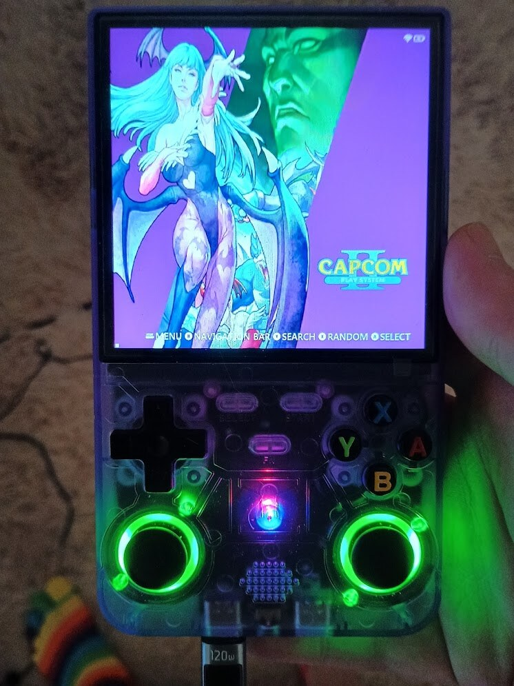
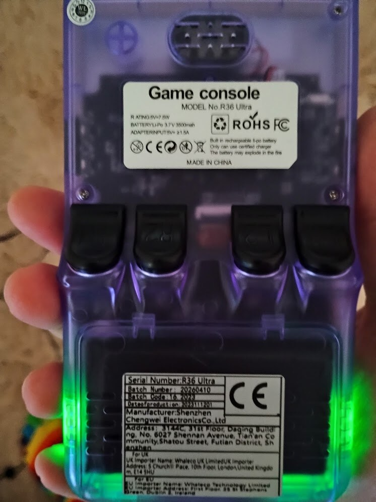

I bought an R36 Ultra and was not happy with the stock emulator setup, so I started looking at how the device was put together. This is only about the unit I have in front of me; these handhelds can vary by seller, batch, and firmware image.

## Initial findings

The first useful discovery was that the visible SD card is not the OS card. The device boots without it. Linux reports a Rockchip RK3326-family board running a vendor EmuELEC 4.7 development image on a 5.10.160 kernel. The OS lives on internal 4 GB eMMC, with a read-only `/flash` partition, writable `/storage`, and the external SD mounted at `/storage/roms`.

## Access and hardening

SSH was listening on the LAN when Wi-Fi was enabled, but the obvious credentials did not work. Access came through the ports launcher instead. The ROM SD card had PortMaster-related folders and a `ports_scripts` path. I added small helper scripts and matching gamelist entries; the launcher ran them as root. One script logged the execution context, and another added my SSH public key to `/storage/.ssh/authorized_keys`.

After that I could SSH in as `root` using key authentication. I then hardened SSH with a persistent service override: password, keyboard-interactive, and challenge-response auth are disabled, and root login is key-only. I found no pre-existing login keys in the locations checked, but that is not proof the vendor image is trustworthy.

## Hardware notes

The hardware looks like the usual RK3326 handheld shape: four Cortex-A35-class cores, about 1 GB RAM, Mali-G31 graphics, a 720x720 DSI panel, RK817 audio/power components, RK915 SDIO Wi-Fi, internal eMMC, and external SD for ROMs.

## Backups and scans

I made two important backups before going further: a config backup from `/storage`, and a full raw image of the internal eMMC. The ROM SD card also has a raw image backup plus a file-level copy. ClamAV scans over the extracted stock OS files, helper scripts, ROM-card copy, and partial ArkOS4Clone download found zero infected files. That is only a commodity malware check, not a firmware trust guarantee.

## Next experiment

The bootloader strings are encouraging for safer OS testing. Stock U-Boot appears to scan external SD before internal eMMC and looks for standard extlinux or boot script paths. That means the next sensible experiment is not flashing internal storage. It is writing a verified ArkOS4Clone or ROCKNIX image to SD and seeing whether the device boots from it. If it fails, removing the SD should leave the internal EmuELEC install as the fallback.

## What I changed

- Added my SSH key.
- Hardened SSH.
- Added temporary helper scripts and gamelist entries.
- Made backups.
- Installed PS1 BIOS files.
- Fixed a broken Final Fantasy IX core override.

## What I did not change

- Internal bootloader.
- Trust partition.
- Kernel.
- DTB.
- `/flash/SYSTEM`.
- ArkOS4Clone update scripts.

Internal eMMC install can wait until SD boot and recovery are proven.
